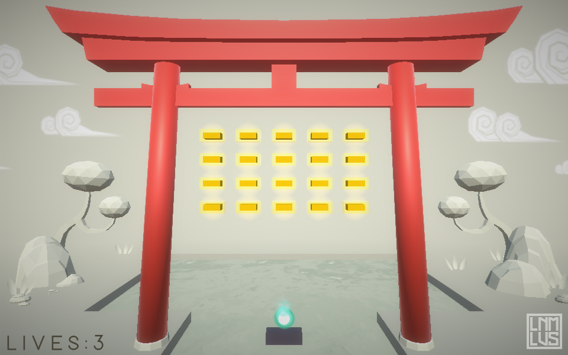

# Breakout Game

A Breakout-style game made with Unity in C#.

## About

This repository contains a Unity WebGL export of a small Breakout-style game (web browsers only). The build was exported to the `Build` and `TemplateData` folders and is launched from `index.html`.

## 🕹️ Try it online

Play instantly in your browser — no download required.

## 🔗 Let's Connect

This was my first published game project — a Unity 5 Breakout clone built while learning the fundamentals through the **[Creating a Breakout game for beginners](https://www.youtube.com/watch?v=t_ahbdB0AnI)** tutorial. After completing the core mechanics, I expanded on it by applying my own artistic direction and visual improvements.

It’s a small but meaningful milestone in my path as a developer and artist. If you're into game development, Unity, or visual design in games, feel free to reach out — I'd love to connect and exchange ideas!

## License

This project is licensed under the MIT License.

Note: Visual assets and artwork are original and are not covered by the license. Please do not reuse them without permission.
